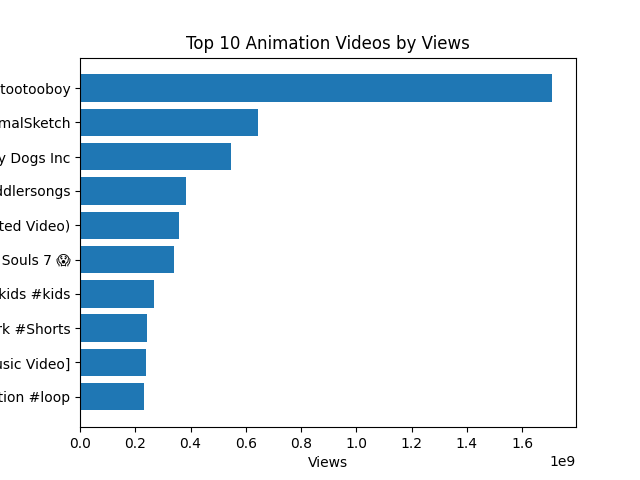
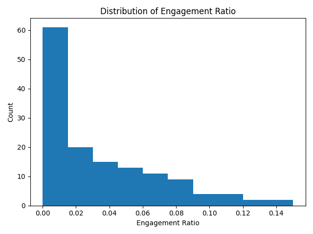
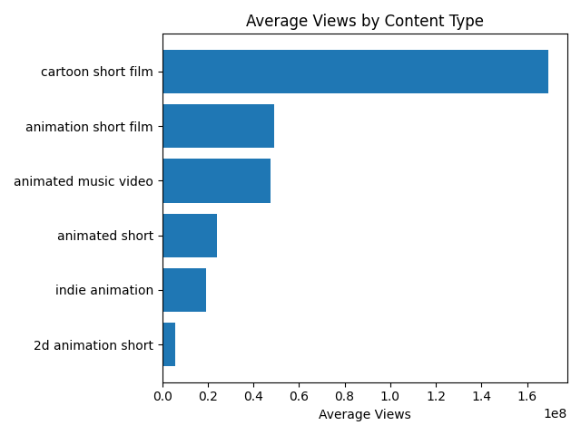

# YouTube Animation Content Analysis

## Overview
This project analyzes YouTube animation content to identify patterns in video performance, engagement, and content strategy.

The goal is to understand what types of animation content generate the most views versus the most audience engagement.

## Data Collection
- Data was collected using the YouTube Data API.
- Multiple search queries were used:
  - animation short film
  - animated short
  - indie animation
  - cartoon short film
  - 2d animation short
  - animated music video
- Final dataset: 141 unique videos.

## Features Engineered
- `publish_year`
- `publish_month`
- `title_length`
- `engagement_total` = likes + comments
- `engagement_ratio` = engagement_total / views

## Key Findings

### 1. Reach vs Engagement Tradeoff
- `cartoon short film` had the highest average views (~169M).
- `cartoon short film` also had the lowest engagement ratio (~0.008).

- `indie animation` had lower average views (~19M).
- `indie animation` had the highest engagement ratio (~0.071).

This suggests a tradeoff between large-scale reach and deep audience engagement.

### 2. Two Different Content Strategies
The analysis suggests two broad strategies:
- **High-reach content**: broader appeal, larger average views, lower engagement ratio
- **High-engagement content**: smaller reach, but stronger audience connection

### 3. Implications for Independent Creators
For independent creators, engagement-driven content may be more valuable than content optimized purely for scale.

## Visualizations

### Top Viewed Videos


### Engagement Ratio Distribution


### Average Views by Content Type


## Tools Used
- Python
- Pandas
- Matplotlib
- YouTube Data API

## Project Structure
```text
animation-youtube-analysis/
├── data/
├── src/
├── visuals/
└── README.md