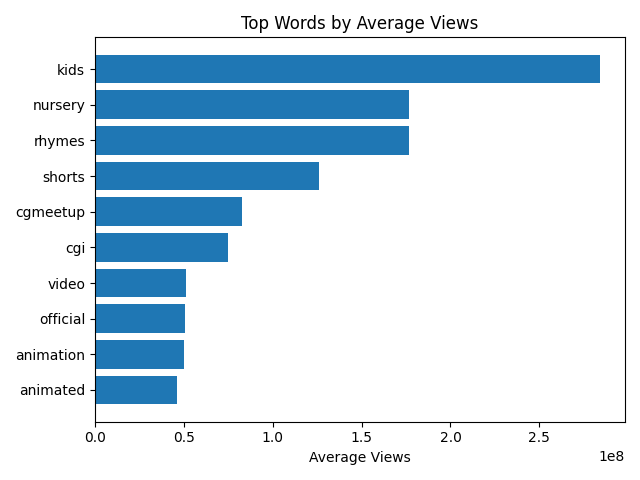

# YouTube Animation Content Analysis

## Overview
This project analyzes YouTube animation content to identify patterns in video performance, engagement, and content strategy.

The goal is to understand what types of animation content generate the most views versus the most audience engagement.

---

## Data Collection
- Data was collected using the YouTube Data API.
- Multiple search queries were used:
  - animation short film
  - animated short
  - indie animation
  - cartoon short film
  - 2d animation short
  - animated music video

---

## Tools Used
- Python
- Pandas
- Matplotlib
- YouTube Data API

---

## Project Structure
animation-youtube-analysis/
├── data/
├── src/
├── visuals/
└── README.md

---

## YouTube Animation Content Analysis

### Key Findings
- "Cartoon short film" content tends to receive the highest views.
- "Indie animation" content tends to have higher engagement ratios.
- There is a tradeoff between mass-view content and high-engagement content.

### Visualizations

---

## Title & Content Strategy Analysis

### Overview
This project analyzes the language used in YouTube animation video titles to understand how specific words relate to video performance.

### Key Findings
- Titles containing mass-audience keywords such as "kids", "nursery", and "rhymes" are associated with significantly higher average views.
- General animation terms (e.g., "animated", "short film") show moderate performance.
- Suggests a divide between broad-consumption content and niche storytelling content.

### Visualization

